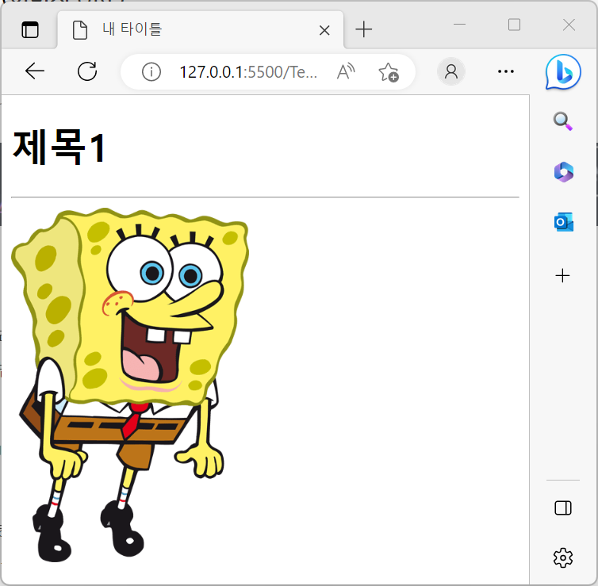
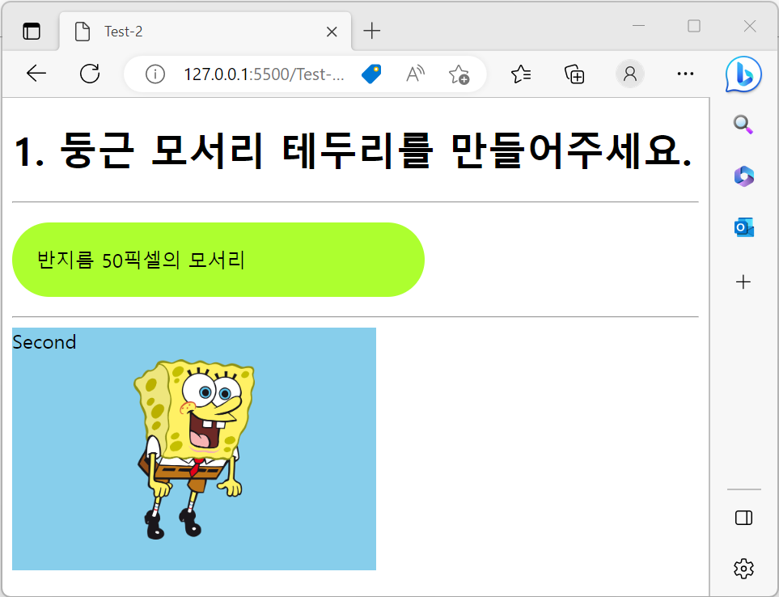
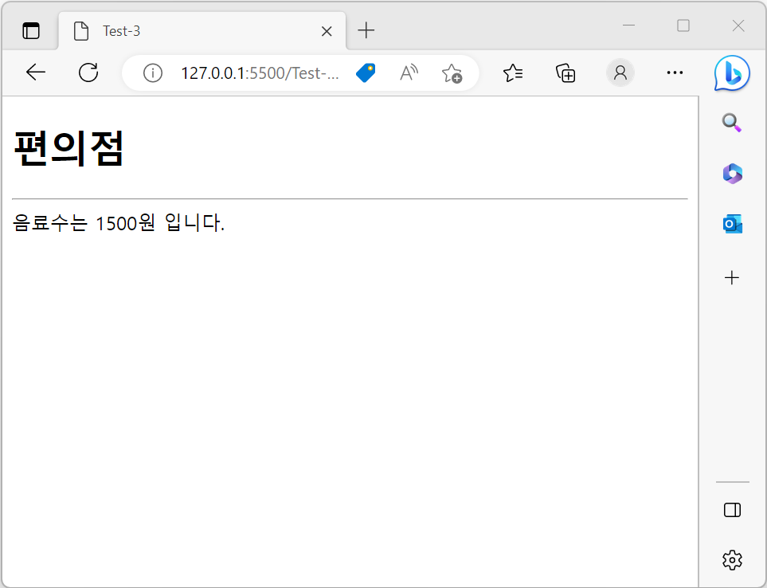

# Level Test

본격적인 수업 시작에 앞서 여러분들이 HTML/CSS/JS 를 얼마나 학습하였는지 알아보고자 합니다.

[과제 링크](https://classroom.github.com/a/eWd72yXo "과제 링크")

## #Test-1

Test-1 폴더의 First.html를 다음 조건에 맞게 작성해보세요.

> 1. `<!doctype>` 태그를 사용해 문서의 정보를 표시해야 합니다.
> 2. `<html>` 태그 안에는 `<head>`와 `<body>` 태그가 들어가야 합니다.
> 3. `<head>` 태그에는 html 문서의 타이틀을 작성해주세요.
> 4. `<body>` 태그에는 문단 제목, 수평선, 이미지가 들어가야 합니다. (1.png 이용)

아래의 작성 결과를 참고하세요.

## #Test-2
Test-2 폴더의 Second.html, Style.css를 다음 조건에 맞게 작성해보세요.
> 1. Second.html과 Style.css를 연결하는 코드를 작성하세요.
> 2. id 가 round 인 `
` 태그가 반지름 50 픽셀의 둥근 모서리가 되도록 Style.css를 작성하세요
> 3. div 태그가 다음 속성을 갖도록 Style.css를 작성하세요
>>* div 박스는 폭 300, 길이 200의 크기를 가집니다.
>> * 박스의 배경 색상은 skyblue이며, 배경 이미지는 100px X 100px 크기를 가집니다.
>> * 배경 이미지는 반복 되지 않아야 하며, 가운데에 위치해야 합니다.

아래의 작성 결과를 참고하세요

## #Test-3
Test-3 폴더의 Third.html을 다음 조건에 맞게 작성해보세요.
> 1. 페이지가 열리면 prompt를 통해 문자열을 입력받습니다.
> 2. 이때 입력받은 문자열이 음료수라면 price = 1500 과자라면 price = 3000 입니다.
> 3. 입력받은 문자열과 price를 출력하세요.
> 4. 입력받은 문자열이 음료수도 과자도 아니면 웹 페이지에 "잘못된 입력 입니다" 라고 출력하도록 Script 를 작성하세요. 

아래의 작성 결과를 참고하세요 

