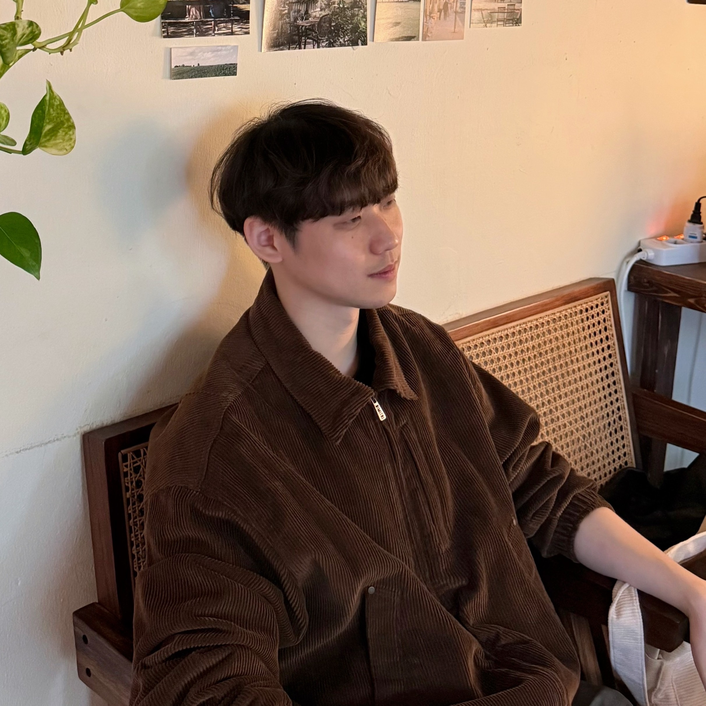

<section class="cv-layout">
  <section class="cv-card cv-card-main">
    

      

        

          
        

        

          <h1 class="cv-name">서정훈 / JeongHun Seo</h1>
          

            M.S. Student, Department of Information and Communication Engineering  
            Chungbuk National University
          

          

            <ul class="cv-contact">
              <li>
                <a href="mailto:dev.jhseo@gmail.com"><IconMail /></a>
              </li>
              <li>
                <a href="https://linkedin.com/in/정훈-서-59b7a936a"><IconLinkedin /></a>
              </li>
              <li>
                <a href="https://github.com/jeonghun-seo"><IconGithub /></a>
              </li>
            </ul>
          

        

      

    

  </section>
    <section class="cv-grid">
          <section class="cv-card">
            <h2 class="cv-section-title">Research Interests</h2>
            <ul class="cv-list">
              <li>
                <strong>Large Language Models</strong> 
                Instruction tuning, Hallucination analysis, RAG
              </li>
              <li>
                <strong>Recommendation System</strong> 
                Spatio-Temporal, Context-aware, Next PoI
              </li>
              <li>
                <strong>Graphs & Knowledge</strong> 
                Graph theory, Knowledge graphs, GNN
              </li>
            </ul>
          </section>
        <section class="cv-card">
            <h2 class="cv-section-title">Education</h2>
            <ul class="cv-list">
                <li>
                    <strong>M.S. in Information and Communication Engineering</strong> 
                    Chungbuk National University, 2025 -   
                </li>
                <li>
                    <strong>B.S. in Computer Engineering</strong> 
                    Korea National University of Transportation, 2019 - 2024  
                </li>
            </ul>
        </section>
    </section>
</section>
